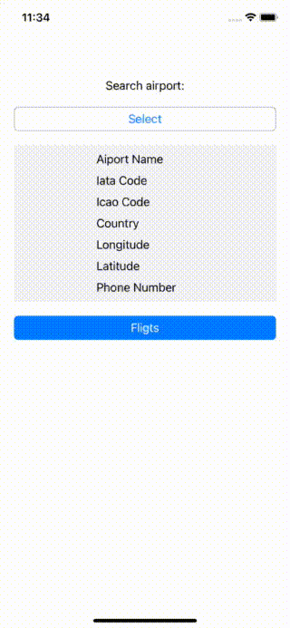

# Airports
You can looking your favorite airport and see today flights.



## Setup
First step you must to install pods

```bash
 pod install 
```

Second step register and copy api key with 
 - [Api GoFlightLabs](https://www.goflightlabs.com)
 - write key to Network -> FlighLabsService -> apiKey
 
 ## Stack
 
- [RxSwift](https://github.com/ReactiveX/RxSwift)
- [RxCocoa](https://github.com/ReactiveX/RxSwift)
- [ReactiveCoordinator](#)
- [SwiftyJSON](https://github.com/tristanhimmelman/ObjectMapper)
- [SwiftLint](https://github.com/realm/SwiftLint)
